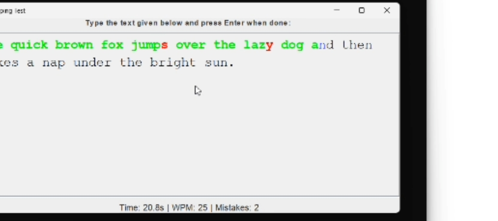
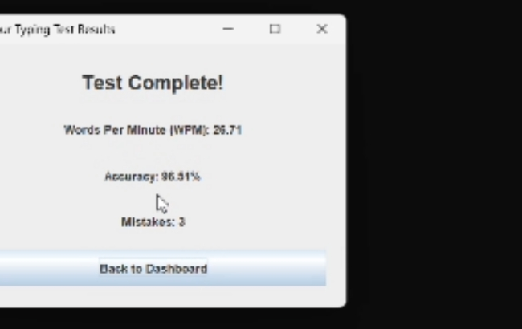

# TypeSpeed — Java Swing Typing Speed Test & Performance Analytics App

A desktop typing speed test application built with Java Swing featuring real-time words-per-minute (WPM) tracking, live character-level accuracy feedback, a persistent global leaderboard, per-user history, and a role-based free/premium account system.

This project was developed to demonstrate object-oriented software engineering concepts including inheritance, polymorphism, interfaces, generics, and the Observer design pattern in a practical desktop application.

## Screenshots


| Live Typing Test | Results |
|---|---|
|  |  |

## Features

- Real-time WPM, accuracy, and mistake tracking with color-coded typing feedback
- Easy, Medium, and Hard typing tests loaded from external text files
- Secure user registration and login using SHA-256 password hashing
- Free and Premium account tiers with feature-based access
- Global leaderboard implemented using a generic `Leaderboard<T extends Result>` class
- Personal typing history with sorting
- Export typing history to a `.txt` file (Premium users)
- Persistent storage using Java object serialization

## Object-Oriented Concepts

| Concept | Implementation |
|----------|----------------|
| Abstraction & Inheritance | `User` → `FreeUser`, `PremiumUser` |
| Interfaces & Polymorphism | `TypingBehavior` |
| Generics | `Leaderboard<T extends Result>` |
| Observer Pattern | `TypingTestGUI.TypingTestListener` |
| Event-Driven Programming | Swing `KeyListener`, `ActionListener`, `Timer` |
| File I/O & Serialization | `ObjectInputStream`, `ObjectOutputStream`, `BufferedReader` |
| Security | SHA-256 password hashing (`MessageDigest`) |

## Tech Stack

- Java (JDK 8+)
- Java Swing
- Java Object Serialization
- Object-Oriented Programming
- Observer Design Pattern

## Project Structure

```text
typing-speed-analyzer/
├── src/com/typingapp/
│   ├── TypingApp.java
│   ├── LoginScreen.java
│   ├── DashboardScreen.java
│   ├── TypingTestGUI.java
│   ├── TypingTest.java
│   ├── FeedbackAnalyzer.java
│   ├── Leaderboard.java
│   ├── User.java
│   ├── FreeUser.java
│   ├── PremiumUser.java
│   └── ...
├── resources/
│   ├── easy.txt
│   ├── medium.txt
│   └── hard.txt
├── LICENSE
└── README.md
```

## Getting Started

### Requirements

- JDK 8 or later

### Clone the Repository

```bash
git clone https://github.com/MusaSajjad2003/typing-speed-analyzer.git
cd typing-speed-analyzer
```

### Compile

```bash
javac -d out $(find src -name "*.java")
```

### Run

```bash
java -cp out com.typingapp.TypingApp
```

On the first run, the application creates `users.dat` and `results.dat` to store user accounts and typing results.

## Future Improvements

- Replace file-based storage with SQLite or another database
- Add JUnit test coverage
- Implement password reset functionality
- Add customizable typing duration and settings
- Develop a web-based version

## License

This project is licensed under the MIT License. See the [LICENSE](LICENSE) file for details.
